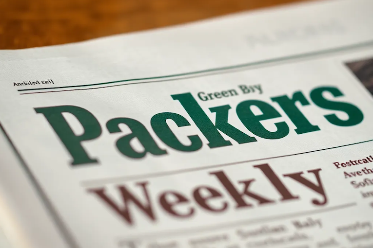

# Packers Weekly Recap: A Tough Week 18 Ahead as Playoffs Loom

**Date: December 31, 2025**

As the Green Bay Packers head into Week 18, fans are grappling with mixed emotions after a series of tough games as the season winds down. Let's break down the most significant stories from the last week.

## Ravens Dominate at Lambeau
In a disheartening **41-24 loss** to the Baltimore Ravens, the Packers struggled to stop the run, allowing an astounding **307 rushing yards** to the Ravens. Star RB **Derrick Henry** was a force, scoring four touchdowns, with **216 rushing yards** on the night. Linebacker **Edgerrin Cooper** expressed the team's disappointment, stating, "That was very embarrassing and that’s just not us at all" ([Cory's Corner](https://cheeseheadtv.com/blog/corys-corner-just-score-baby-138)). Despite strong performances from backup quarterback **Malik Willis**, the defense faltered, indicating considerable concerns heading into the playoffs ([Packers Therapy](https://packerstalk.com/2025/12/31/packers-policy-soft-packers-therapy-498/)).

## Injury Update: Murphy's Law for Packers
Injuries have significantly impacted the Packers' performance, with recent losses of **Micah Parsons**, **Devonte Wyatt**, and others. The Packers are reportedly considering resting key players in the upcoming game against the Vikings, given that they have already locked in the **7th seed** in the playoffs. Coach **Matt LaFleur** faces tough decisions as team morale wanes following three straight losses. Key players like **Jordan Love**, still in concussion protocol, and **Josh Jacobs**, battling knee issues, may also sit out to avoid further injuries ([Pack-A-Day Podcast](https://cheeseheadtv.com/blog/pack-a-day-podcast-episode-2714-is-matt-lafleur-coaching-for-his-job-227)) ([Packers Daily](https://cheeseheadtv.com/blog/packers-daily-it-might-be-tune-time-on-sunday-151)).

## Potential Roster Moves With New Additions
In an effort to bolster the roster, the Packers recently claimed **Jonathan Ford**, a former draft pick, off waivers from the Bears, adding depth to the defensive line. They also promoted cornerbacks **Shemar Bartholomew** and **Jaylin Simpson** from the practice squad ([Acme Packing Company](https://www.acmepackingcompany.com/green-bay-packers-news/77424/packers-make-7-roster-moves-ahead-of-week-18s-action)). This reshuffling follows the season-ending injuries of Jordon Riley and Kamal Hadden, underscoring the urgency for fresh legs heading into the playoffs.

## Coaching Controversies: LaFleur's Job Security?
As murmurs grow about LaFleur's future, discussions are rife over whether he will return next season. With the team on a downward trend, his job appears precarious if a playoff exit occurs, especially with the Packers lacking the success expected from this season. **Fans and analysts alike are questioning if he can salvage a semblance of momentum heading into the postseason** ([Acme Packing Company](https://www.acmepackingcompany.com/green-bay-packers-salary-cap/77382/what-the-packers-salary-cap-situation-could-look-like-in-2026)) ([Cheesehead TV](https://cheeseheadtv.com/blog/why-major-firings-arent-warranted-this-offseason-739)).

## Looking Ahead: Vikings Showdown
As the Packers prepare for their **Week 18 matchup against the Minnesota Vikings**, the game holds no playoff implications for Green Bay but could influence team confidence heading into the postseason. Fans hope for a rebound and a chance for the team to regain some respect on the field. Speculations about possible playoff opponents loom, while key players will likely be rested for strategic reasons ([Packers Talk](https://packerstalk.com/2025/12/30/the-green-bay-packers-defense-has-a-get-right-game-coming-up-against-the-vikings/)).

## Final Thoughts
Despite the challenging circumstances, fans remain hopeful. The playoffs provide a fresh start for the Packers, even if they need to overcome recent struggles and injuries. Remember, it only takes one good game to shift the narrative, so all eyes will be on the Packers as they aim to reestablish their footing in the postseason.

### Links to the Top Reddit Posts
- [Remember, we cheer for the Green Bay Packers](https://www.reddit.com/r/GreenBayPackers/comments/1q02c07/remember_we_cheer_for_the_green_bay_packers/)
- [Green Bay Packers work out former first overall CFL draft pick Joel Dublanko](https://www.reddit.com/r/GreenBayPackers/comments/1q00lz2/green_bay_packers_work_out_former_first_overall/)

### Links to Packers.com Stories
- [Packers announce roster moves | Dec. 30, 2025](https://www.packers.com/news/packers-announce-roster-moves-dec-30-2025)
- [Packers make 7 roster moves ahead of Week 18](https://www.acmepackingcompany.com/green-bay-packers-news/77424/packers-make-7-roster-moves-ahead-of-week-18s-action)

Keep the faith, Packers fans! Go Pack Go!