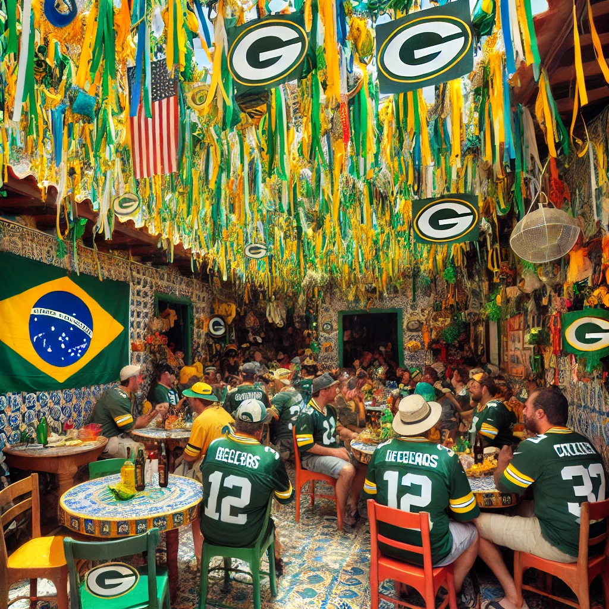
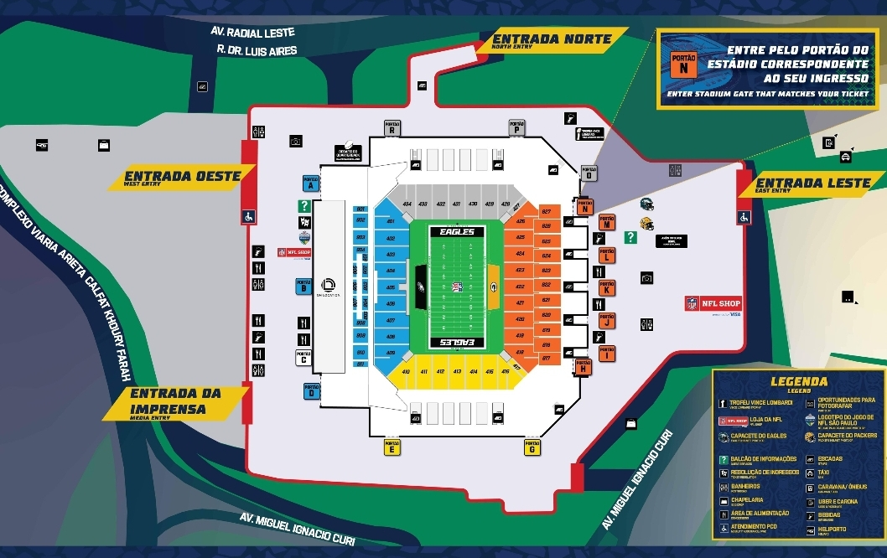
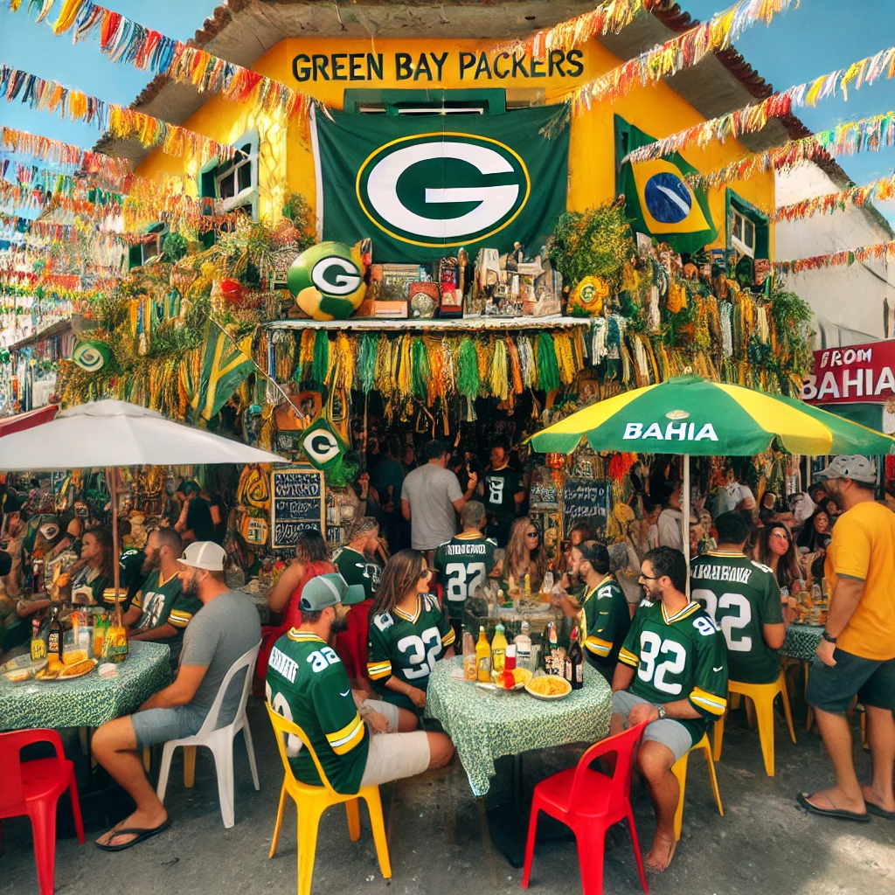

**Last Updated - Thursday, September 5, 2024**
We are constantly monitoring the internet for other options.

If you **have** tickets to the game, it appears that you can enter the NFL Fan Campus immediately outside of Corinthians Arena. Which will have food/drink, the Lombardi Trophy, NFL Store, and other activities before you enter the stadium.

Download the NFL OnePass App ([iPhone](https://apps.apple.com/us/app/nfl-onepass/id1456010454) or [Android](https://play.google.com/store/apps/details?id=com.nfl.fanmobilepass&hl=en_US&pli=1)) to see the Fan Campus Map with more detail (photo below). [There is also a $200 USD tailgate at the Itaquera Mall](https://sportsfanstravel.com/products/green-bay-philadelphia-tailgate-in-sao-paulo), but that is pretty expensive.

## Quick Intro
Corinthians Arena is typically home to a different kind of football. However for the first time, the National Football League (NFL) will be hosting an American Football match - the first of it's kind in South America - between the Green Bay Packers and the Philadelphia Eagles.

It should be noted that for Soccer / Futebol games at stadiums in São Paulo, typically there are "camarote" or VIP sections that are allowed to sell alcoholic drinks 2 hours before and one hour after the game starts/ends. This is a [Sao Paulo State law](https://www.al.sp.gov.br/propositura/?id=1000537922) due to shenanigans occurring in the past between rival fan groups to ensure the safety of everyone during gameday. Even tho during the 2014 World Cup, there were no recorded incidents. 

Now, if you don't live in São Paulo, you may not know where to tailgate prior to the game.

**But first, please be aware of how terrible the traffic can be**! Corinthians Stadium is located in the Eastern part of the city - to go from central São Paulo to Corinthians Arena can be 45 minutes or it can be **2+ hours** - plus, the game is on a Friday when a lot of people want to leave the city for the weekend. Google Maps / Waze / etc aren't reliable.

****
# Where to Tailgate Near Corinthians Arena
We will take a look at places to tailgate near [Corinthians Stadium](https://www.google.com/maps/place/Neo+Qu%C3%ADmica+Arena/@-23.5453134,-46.4768041,862m/data=!3m2!1e3!4b1!4m6!3m5!1s0x94ce66dec98fb855:0xf2b061ffbcd2ecf8!8m2!3d-23.5453134!4d-46.4742292!16s%2Fm%2F0czdxhf?entry=ttu&g_ep=EgoyMDI0MDgyNi4wIKXMDSoASAFQAw%3D%3D) - however, I'd recommend [joining the São Paulo WhatsApp Group](https://chat.whatsapp.com/DCeTE832kUTJfAiskx4krA) to see where members are tailgating prior to the game.

Where to go tailgate will depend on [what neighborhood you'll be in](/blog/where-to-stay-in-sao-paulo-for-nfl-game/). If you're near [O'Malley's](https://maps.app.goo.gl/vkiEhgoQQ5Nfyhm36), they are a "Gringo Bar" and [have NFL games and other sporting events on every weekend](https://www.omalleysbar.net/esportes/). Over the past year, I also helped set it up as the [Packers Everywhere bar](https://www.packerseverywhere.com/find-a-bar/bar-details/Index?id=dade858a-fa8f-6ce3-be09-ff000095b832) in São Paulo. There are a [few other "sports bars"](https://cabecadequeijo.com/blog/sports-bars-in-sao-paulo/) but, I'd recommend just going to a corner Boteco.
****

## Top Places to Tailgate Near Corinthians Arena:
- [Shopping Metro Itaquera](https://www.shoppingitaquera.com.br/) - shopping mall with a Brahma Chopp Kiosk, Outback Steakhouse, Johnny Rockets, and other places to grab a bite to eat.
  - Note - It is about 1 mile walking to go from the Mall to the Stadium.
- [Bars Inside the Stadium](https://www.wikiwand.com/en/articles/Neo_Quimica_Arena) - Gates will open early for people to watch warm ups. There are bars and restaurants inside the stadium - like [Bar do Zeca Pagodinho](https://maps.app.goo.gl/9H5BbLHiR6Y9JhvG8) (famous Brazilian singer-songwriter) and [about 75 other options to choose from](https://www.wikiwand.com/en/articles/Neo_Quimica_Arena)
- Grab a beer from the stand in the Corinthians Metro stop
- Bring drinks with you. [Brazil is an open container country](https://www.reddit.com/r/Brazil/comments/15glmp3/how_loose_are_the_drinking_laws_here/) - meaning you don't need a brown paper bag or anything. Just be aware of your surroundings and don't imbibe too much.
- If I had to bet, I would guess that there will be vendors outside the stadium in the parking lots selling drinks as well.

## How to Get To/From Corinthians Arena
The primary way most Paulistanos go to/from Corinthians stadium would be by using the Metro. The Red Line can take you into the city to connect to other lines to get you closer to your hotels. Uber is very affordable in Brazil and cost will depend on the distance traveled and duration. Again, plan accordingly for there to be traffic. [Read this post to learn more about all of the options](/blog/how-to-get-around-sao-paulo/).

There are a few places to get food near Corinthians Arena. Be sure to check out our brief guide on [food overlap between Brazil and Wisconsin](/blog/culinary-similarities-between-wisonson-brazil/).
