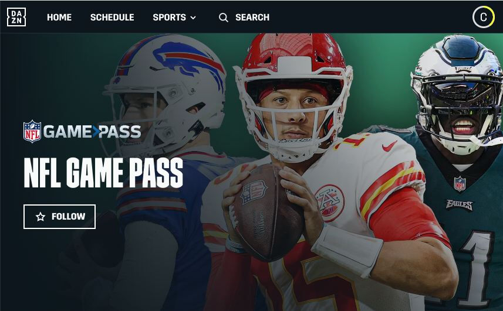

=====

## Growing American Football Culture in Brazil
Since ~2010, American Football has been on the rise in Brazil - similar to the NBA. The Packers have repeatedly been one of the [most rooted for teams in Brazil](https://www.reddit.com/media?url=https%3A%2F%2Fi.redd.it%2F2x3s4o1xme7b1.jpg). We think that this is due to the colors being green and gold (like the flag of Brazil) and because the fans 'own' the team. However, one of the biggest problems that I've found while traveling overseas has been how to watch the Green Bay Packers. 

Whether you are traveling here for [the first ever NFL game in South America](https://www.nfl.com/news/brazil-to-host-first-ever-nfl-regular-season-game-in-south-america-in-2024) or you live in Brazil - this guide will quickly detail how to watch the NFL in Brazil. Watching NFL games across South America is pretty easy to do thanks to their high internet speeds and access to [Starlink](https://www.starlink.com/) in remote areas. Specifically, in the city of Sao Paulo, Brazil, residents can have access to 1GB fiber lines for $100 USD per month or a MUCH cheaper 500 Mbps for ~$20 per month with [Vivo](https://internet.vivo.com.br/ofertas/fibra/).

## The Options We Know Of (scroll down for details)
1. Purchase NFL Game Pass via DAZN (~$75 USD for the entire season!)
2. Use a VPN and connect to the USA to use your existing TV subscription
3. Visit a Sports Bar in São Paulo
4. Have Another Option? [Contact Us](/contact).

<!-- 
_Image courtesy of [NFL Brasil](https://instagram.com/nflbrasil) (source: [Reddit](https://www.reddit.com/r/GreenBayPackers/comments/14fdmhw/the_packers_are_the_most_popular_nfl_team_in/))_ -->

## NFL Game Pass + NFL Network with DAZN

This is the easiest option if you live in South America. Or if you are visiting South America and can use Google Translate with an international credit card, this is also an option.

### Steps:
1. Go to [DAZN.com](https://dazn.com) ([direct link for NFL Game Pass Sign Up](https://www.dazn.com/en-BR/account/content/NFL/signup))
1. Create an Account
1. Complete Purchase the NFL Game Pass (currently ~$75 USD per year)

Once you have done the above, there are many ways to watch DAZN.
- Mobile App for [iPhone](https://apps.apple.com/gb/app/dazn-stream-live-sports/id1129523589) and [Android](https://play.google.com/store/apps/details?id=com.dazn&hl=en_US&gl=US) devices
- Smart TV Applications / [Google Chromecast App](https://www.dazn.com/en-CA/help/articles/how-to-watch-dazn-on-chromecast-ca) / etc.
- From your computer at [dazn.com](https://dazn.com)

## Using a VPN

If you are technically savvy, this option is straight forward. It also assumes that you already have a television/streaming provider - like DirectTV, YouTubeTV, etc...

Steps to use a VPN:
1. Purchase access to a Virtual Private Network (VPN) (we've used [NordVPN](https://nordvpn.com/))
1. Connect to the city nearest your home residence - _this is important because some of these services try to weed out the VPN servers and block them from accessing their services_ 
1. Open your a new web browser session with cookies cleared and access your streaming service

__Note:__ _If you have problems with a specific connection, try to change to another VPN connection and see what happens._

## Going to a Sports Bar
For some reason or another, finding a place like Buffalo Wild Wings is pretty difficult in Brazil. Typically, soccer matches between clubs are played on small TV's at the corner botecas. Fans used to gather at Applebee's but, it appears that most locations in São Paulo have closed. However, there is also the American Staple - [TGI Fridays](https://www.google.com/maps/search/TGI+Fridays/@-23.6011142,-46.6829626,14z/data=!3m1!4b1?entry=ttu), but they're typically in shopping malls. We cannot speak from experience, but that seems like a bit of a different vibe for watching an NFL game...

Here is a short list of bars in São Paulo that we know of with TV's that will play the NFL.

- [O'Malley's](https://www.omalleysbar.net/) - _typically __PACKED__ with NFL fans every game day_
- [Goose Island Brewery São Paulo](https://www.instagram.com/gooseislandsp/)
- [Flames Tap House](https://www.instagram.com/flamestaphouse/)

My one piece of advice is to reach out to the bar on Instagram or via What'sApp to confirm that they will have the game you are looking for. It's happened a couple times where we have gone to a "sports bar" only to find that they did not have the game on.

---

Hopefully this quick guide will make it a little bit easier for you to watch your favorite NFL team in Brazil. If you know of any other ways to watch or other sports bars, please [Contact Us](/contact) and we will update this post.

---

#### _Note: This is not an endorsement of any particular product or service or a way to stream illegally. This is only to show people how to watch the NFL while traveling._
