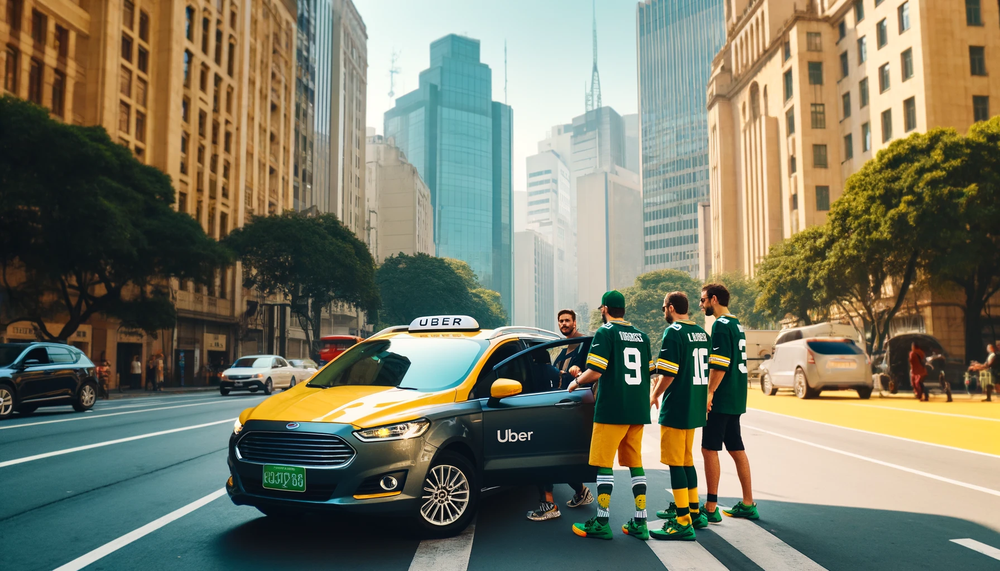
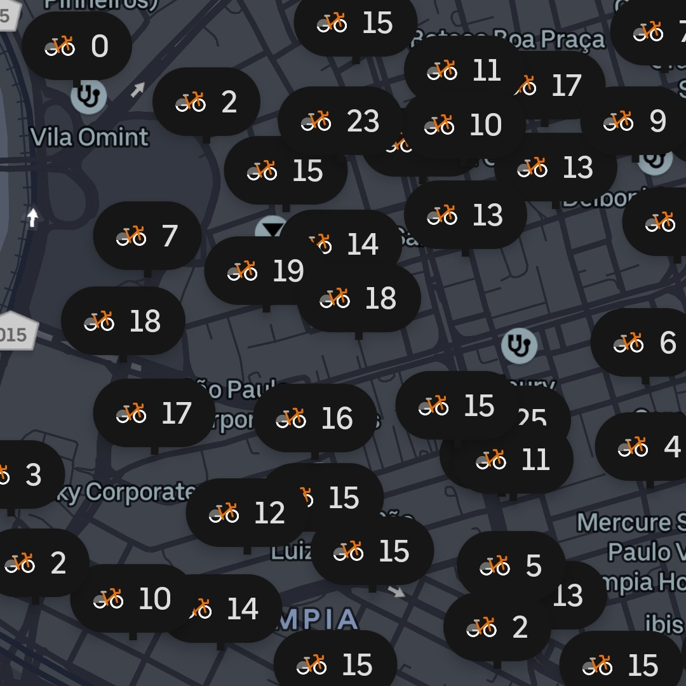
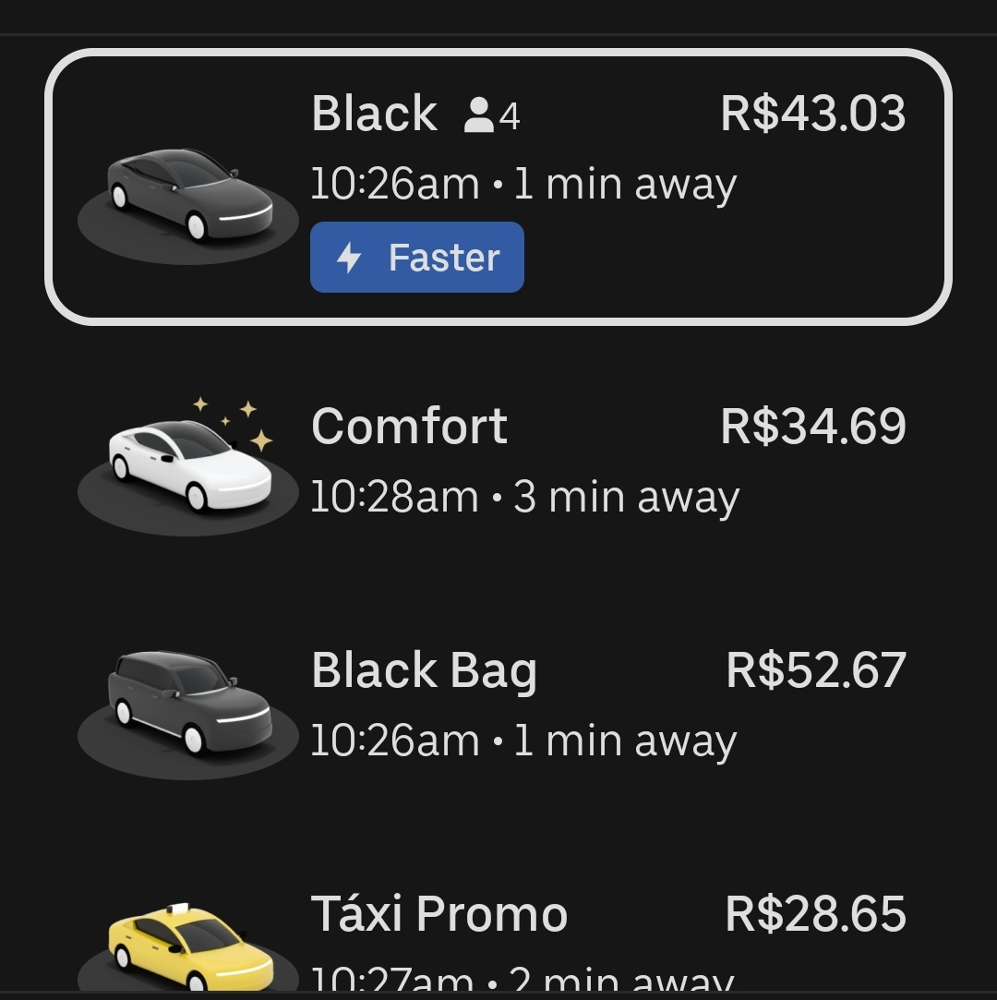

## Getting Around Sao Paulo for the NFL Game
As we've mentioned numerous times in other posts - São Paulo is a mega city. However, with it being so large, there are plenty of options and a range of prices to get around.

## Walking
Fortunately, if you [pick a good neighborhood to stay](/blog/where-to-stay-in-sao-paulo-for-nfl-game) - you will be able to walk to and from the attractions in the neighborhood. Typically when it is dark, we will still use an Uber for safety.

## Biking
With the Uber app, you are able to unlock the electric or non-electric Orange Bike Itau bikes. These are very similar to [NYC Citi Bikes](https://citibikenyc.com/) or to [Capital Bike share bikes in D.C.](https://capitalbikeshare.com/).

The rates are extremely reasonable and the same between electric and non-electric Itau bikes. It is 4.39 BRL to unlock the bike and an additional 0.40 BRL per minute of riding. For a 30 minute bike ride, it would cost $3.19 USD.

Before selecting and scanning a bike to rent, ensure that it looks ok, the wheels move, etc. There are even [protected bike paths across the city](https://www.google.com/maps/d/viewer?mid=1TPU9-1i0WBqH5qTCCn9d-SxpAqU&hl=en_US&ll=-23.636774411965604%2C-46.690994830419925&z=12).

## Bus or Metro via [SPTrans](https://www.sptrans.com.br/)
If you do not have a CPF number, we would not recommend this option since acquiring a metro/bus card can be an multiple-hour-long-ordeal. It also requires working knowledge of Brazilian Portuguese to interact with the attendant to receive the card. Typically the bus is 4.90 BRL - we are unsure if the metro is the same price.

## Uber
By far the most convenient option. The screenshot above shows what it would cost for 3 different types of Ubers to go approximately 4 miles (25 minutes).

Ubers, like all other services in Brazil, are very cost effective. Most trips around the city will be $5 USD to $10 USD depending on the distance and type of Uber you select.

We strongly recommend that you utilize Uber Black since we have had UberX cancel on us numerous times. The cost differential is minimal and it will save you a bit of frustration.

## Renting a Car
Probably impractical for most people coming to Brazil for the NFL Game - especially if staying in a hotel or at an AirBnB (parking is tricky or will be ~$20 per day).

However, you can rent a car using your Passport at Unidas, Movida, and other businesses to get from São Paulo to other cities in the country. Booking.com and other travel aggregate sites also allow for the booking of vehicles - just be sure all of the information you enter matches the driver's info and that you bring the Credit Card used to make the reservation.

If you are planning on staying longer in Brazil (we'd recommend this) you can easily drive an hour down the road to the beach town and birthplace of Pelé and Neymar - Santos. 

## Hire A Private Driver
This is the most surefire way to get around the city with the least amount of waiting and nonsense. However - it comes with a price. You can expect the hourly rate to be anywhere from $5 USD to $25 USD - so, if they are waiting / driving you all day, it will add up quick. Some of the private drivers have the spacial placards that allow them to use the Bus Lane - making traffic a little more tolerable.

## Helicopter
Obviously, the quickest way to go from A to B - assuming each place has a helipad for you to land. Helicopters were so common in São Paulo that [Uber launched it as a service back in 2016](https://www.reuters.com/article/idUSKCN0Z005C/). It has since stopped offering this - however, the companies below are around - 
- [Fly Revo](https://flyrevo.com/pt-BR/home)
- [Flapper](https://flyflapper.com/en) - more for private jets

From a quick search on Fly Revo, you can go from GRU Airport to Faria Lima in 15 minutes for [$500 to $600 USD](https://flyrevo.com/pt-BR/booking/pick?zoom=13&type=departureFlight&destFlightHelipadDistrict=S%C3%A3o+Paulo&origFlightHelipadDistrict=Aeroporto+de+Guarulhos&totalPassengers=1&departureFlight.departureDate=2024-05-17T00%3A00%3A00.000Z&lat=-23.613018420086462&lng=-46.71003204822424).

## Summary of Transit Options
Hopefully the above information helps you get around São Paulo while visiting. It's a HUGE city with a lot to offer.

---

#### _Note: If riding a bicycle please take all necessary precautions when riding in a city. This website is not liable for any injury/harm that may occur._
