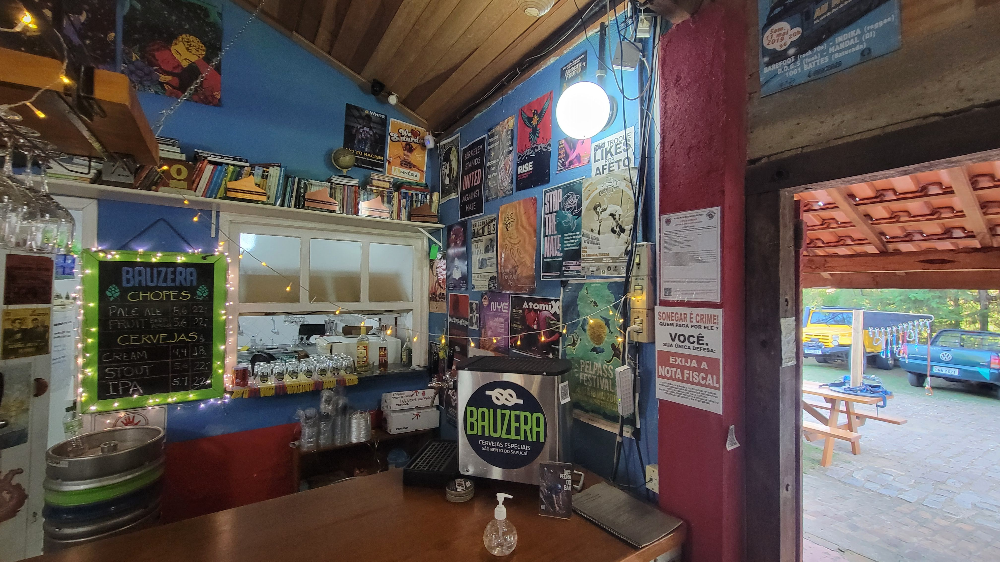

## How to Order a Beer in Portuguese

The easiest way is to walk up to a corner store Boteco or any other bar and ask for a "**Cerveja**". However, it's hard to explain how to pronounce words using only text - you can rely on [Uncle Brazil](https://www.youtube.com/@UncleBrazil) to help you order a beer four different ways.

If you are looking for the [PackersEverywhere.com Bar](https://www.packerseverywhere.com/find-a-bar/bar-details/Index?id=dade858a-fa8f-6ce3-be09-ff000095b832) in Sao Paulo, [you can read more about our announcement here](/blog/announcing-omalleys-as-the-packers-everywhere-bar/).

Here is a post with [our favorite craft breweries in Sao Paulo](/blog/beer-to-try-in-sao-paulo/) to try out.

