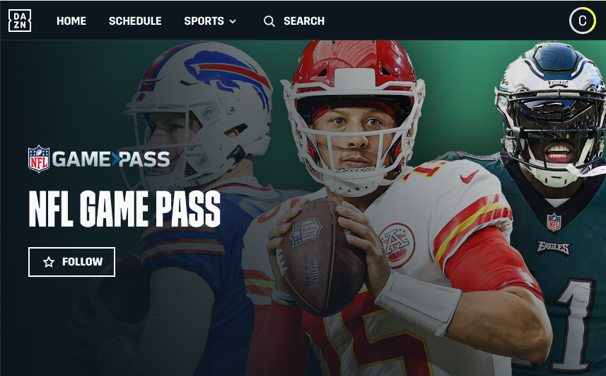
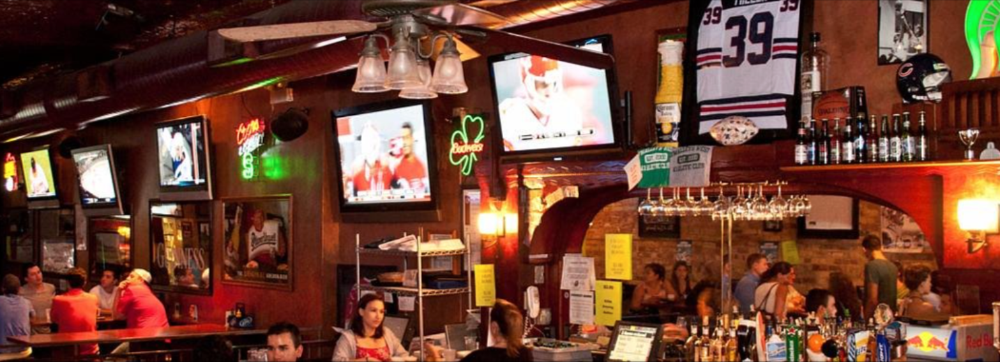

## Crescimento da Cultura do Futebol Americano no Brasil
Desde aproximadamente 2010, o futebol americano tem crescido no Brasil - similarmente ao que aconteceu com a NBA. Os Packers têm sido repetidamente um dos [times mais torcidos no Brasil](https://www.reddit.com/media?url=https%3A%2F%2Fi.redd.it%2F2x3s4o1xme7b1.jpg). Achamos que isso se deve ao fato das cores serem verde e dourado (como a bandeira do Brasil) e porque os torcedores "possuem" o time. No entanto, um dos maiores problemas que encontrei ao viajar para o exterior foi como assistir aos jogos do Green Bay Packers.

Seja você um viajante vindo para [o primeiro jogo da NFL na América do Sul](https://www.nfl.com/news/brazil-to-host-first-ever-nfl-regular-season-game-in-south-america-in-2024) ou alguém que mora no Brasil - este guia detalhará rapidamente como assistir à NFL no Brasil. Assistir aos jogos da NFL na América do Sul é bem fácil, graças às altas velocidades de internet e ao acesso ao [Starlink](https://www.starlink.com/) em áreas remotas. Especificamente, na cidade de São Paulo, os moradores podem ter acesso a linhas de fibra de 1GB por $100 USD por mês ou uma opção MUITO mais barata de 500 Mbps por ~R$100 por mês com a [Vivo](https://internet.vivo.com.br/ofertas/fibra/).

## As Opções Que Conhecemos (role para baixo para mais detalhes)
1. Comprar NFL Game Pass via DAZN (~$75 USD para a temporada inteira!)
2. Usar um VPN e conectar-se aos EUA para usar sua assinatura de TV existente
3. Visitar um Sports Bar em São Paulo
4. Tem Outra Opção? [Entre em Contato](/contact/).

<!-- 
_Imagem cortesia da [NFL Brasil](https://instagram.com/nflbrasil) (fonte: [Reddit](https://www.reddit.com/r/GreenBayPackers/comments/14fdmhw/the_packers_are_the_most_popular_nfl_team_in/))_ -->

## NFL Game Pass + NFL Network com DAZN

Esta é a opção mais fácil se você mora na América do Sul. Ou, se você está visitando a América do Sul e consegue usar o Google Tradutor com um cartão de crédito internacional, esta também é uma opção.

### Passos:
1. Acesse [DAZN.com](https://dazn.com) ([link direto para assinar o NFL Game Pass](https://www.dazn.com/en-BR/account/content/NFL/signup))
1. Crie uma Conta
1. Complete a Compra do NFL Game Pass (atualmente ~$75 USD por ano)

Depois de completar os passos acima, há várias maneiras de assistir ao DAZN:
- Aplicativo para dispositivos móveis [iPhone](https://apps.apple.com/gb/app/dazn-stream-live-sports/id1129523589) e [Android](https://play.google.com/store/apps/details?id=com.dazn&hl=en_US&gl=US)
- Aplicativos de Smart TV / [Aplicativo Google Chromecast](https://www.dazn.com/en-CA/help/articles/how-to-watch-dazn-on-chromecast-ca) / etc.
- Do seu computador em [dazn.com](https://dazn.com)

## Usando um VPN

Se você tem conhecimentos técnicos, esta opção é bem simples. Ela também assume que você já tem um provedor de televisão/streaming - como DirectTV, YouTubeTV, etc...

Passos para usar um VPN:
1. Compre acesso a uma Rede Privada Virtual (VPN) (já usamos o [NordVPN](https://nordvpn.com/))
1. Conecte-se à cidade mais próxima da sua residência - _isso é importante porque alguns desses serviços tentam bloquear servidores VPN e impedir o acesso aos seus serviços_
1. Abra uma nova sessão no navegador com os cookies limpos e acesse seu serviço de streaming

__Nota:__ _Se você tiver problemas com uma conexão específica, tente mudar para outra conexão de VPN e veja o que acontece._

## Indo a um Sports Bar
Por algum motivo, encontrar um lugar como Buffalo Wild Wings é bem difícil no Brasil. Normalmente, as partidas de futebol entre clubes são exibidas em pequenas TVs nos botecos de esquina. Antes, os torcedores se reuniam no Applebee's, mas parece que a maioria dos locais em São Paulo fechou. No entanto, ainda há o clássico americano - [TGI Fridays](https://www.google.com/maps/search/TGI+Fridays/@-23.6011142,-46.6829626,14z/data=!3m1!4b1?entry=ttu), mas eles geralmente estão em shoppings. Não podemos falar por experiência própria, mas parece que é um ambiente um pouco diferente para assistir a um jogo da NFL...

Aqui está uma lista curta de bares em São Paulo que sabemos que têm TVs que exibem a NFL.

- [O'Malley's](https://www.omalleysbar.net/) - _tipicamente __LOTADO__ de torcedores da NFL em todos os dias de jogo_
- [Goose Island Brewery São Paulo](https://www.instagram.com/gooseislandsp/)
- [Flames Tap House](https://www.instagram.com/flamestaphouse/)

Minha única dica é entrar em contato com o bar no Instagram ou via WhatsApp para confirmar se eles terão o jogo que você procura. Aconteceu algumas vezes de irmos a um "sports bar" e descobrirmos que eles não tinham o jogo na TV.

---
Esperamos que este guia rápido torne mais fácil para você assistir ao seu time favorito da NFL no Brasil. Se você conhece outras maneiras de assistir ou outros sports bars, por favor, [Entre em Contato](/contact/) e atualizaremos este post.

---
#### _Nota: Este post não é um endosso de nenhum produto ou serviço específico ou uma maneira de transmitir ilegalmente. Isso é apenas para mostrar às pessoas como assistir à NFL enquanto viajam._
