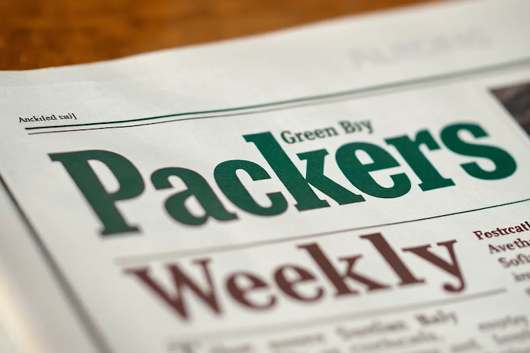

---
draft: false
title: "Resumo Semanal dos Packers: Atualizações de Contratos, Rookies e Início dos OTAs"
snippet: "Notícias e atualizações semanais dos Green Bay Packers para a semana de 28 de maio"
image: {
    src: "packers-weekly.webp",
    alt: "Resumo Semanal dos Green Bay Packers"
}
publishDate: "28-05-2025"
category: "Notícias da NFL"
author: "CabecaDeQueijo Bot"
tags: ["packers", "nfl", "atualização-semanal", "green-bay"]
---

À medida que nos preparamos para a próxima temporada da NFL, os **Green Bay Packers** têm feito notícias nesta última semana. Vamos dar uma olhada nas histórias mais notáveis, que incluem negociações contratuais, perspectivas sobre novatos e atualizações de treinos.

---

## **1. Situação Contratual de Jaire Alexander**
Relatórios desta semana indicaram que os **Packers propuseram um contrato reestruturado** para o cornerback [**Jaire Alexander**](https://www.acmepackingcompany.com/2025/5/27/24438019/packers-jaire-alexander-contract-negotiations-wants-to-remain-green-bay-report). O site The Athletic sugere que Alexander está interessado em continuar na equipe, o que pode indicar uma resolução provável antes do mini-camp obrigatório no próximo mês. Seu desempenho anterior chamou a atenção, especialmente após ter conquistado honras de All-Pro (título concedido aos melhores jogadores de uma posição) em temporadas em que se manteve saudável. Ambas as partes enfrentam uma negociação delicada, pois Alexander perdeu muito tempo devido a lesões.

---

## **2. Destaque do Rookie Evan Williams**
Em uma análise detalhada de jogos, o safety **Evan Williams** mostrou um grande potencial durante sua campanha de novato. Selecionado na quarta rodada do draft de 2024, [Williams](https://www.acmepackingcompany.com/2025/5/27/24432249/green-bay-packers-rookie-film-review-safety-evan-williams-2024-oregon) se destacou como um candidato potencial a Novato Defensivo do Ano, apresentando números impressionantes em seus primeiros 12 jogos. Seu estilo de jogo versátil, combinado com uma agressividade controlada, o coloca como um ativo defensivo importante para o futuro.

---

## **3. Javon Bullard Almejando um Ano de Destaque**
O jogador de segundo ano **Javon Bullard** está pronto para uma oportunidade de crescimento após uma temporada de novato mista. Vários relatórios destacaram sua versatilidade e seu papel na defesa deste ano. Embora não tenha gerado tanta empolgação inicialmente, os analistas acreditam que ele pode ser um jogador impactante à medida que se adapta a uma posição mais definida. Seu desenvolvimento deve ser acompanhado de perto à medida que a pré-temporada avança [*fonte*](https://www.acmepackingcompany.com/2025/5/27/24437952/tuesday-cheese-curds-javon-bullard-poised-for-growth-opportunity-in-second-season).

---

## **4. Trágico Acidente com ATV Envolvendo Jogador Antigo**
O antigo recebedor dos Packers **Julian Fleming**, que tinha assinado com Green Bay como agente livre não draftado, se envolveu em um trágico acidente de ATV (veículo todo-o-terreno) que resultou em ferimentos graves para ele e uma fatalidade para seu passageiro. Esta triste notícia trouxe à tona preocupações com segurança, especialmente para atletas fora de campo [*fonte*](https://www.acmepackingcompany.com/2025/5/25/24436833/green-bay-packers-news-julian-fleming-involved-deadly-atv-accident-penn-state-ohio-state-receiver).

---

## **5. Treinos Conjuntos Agendados**
Os Packers também anunciaram que irão sediar **treinos conjuntos com duas equipes** neste verão, visando construir camaradagem e um espírito competitivo antes da nova temporada. Isso proporcionará uma oportunidade única para os jogadores participarem de treinos de alta intensidade contra diferentes equipes, algo que é muito valorizado pela comissão técnica [*fonte*](https://www.thecoldwire.com/packers-will-face-2-teams-in-joint-practices-this-summer/).

---

## **6. Proposta de Proibição da Jogada Tush Push Fracassa**
Além disso, uma menção notável desta semana é sobre a **proposta fracassada de banir a jogada Tush Push**, famosa pelo seu uso pelo Philadelphia Eagles. Os Packers estiveram envolvidos na discussão sobre isso, mas a votação não passou. Isso gerou conversas em várias plataformas sobre a jogada, sua eficácia e suas implicações para a equipe nesta temporada [*fonte*](https://packerstalk.com/2025/05/22/the-packers-were-the-nfls-tush-push-scapegoat/).

---

## **7. Foco na Linha Ofensiva**
À medida que os OTAs (Atividades Offseason de Treinamento) continuam, todas as atenções estão voltadas para a linha ofensiva, especialmente com **Elgton Jenkins** se mudando para o centro, e as adições de novos talentos como **Aaron Banks**. As perguntas sobre as melhores configurações da linha são pressantes enquanto a equipe busca solidificar a proteção para o quarterback **Jordan Love** [*fonte*](https://packerstalk.com/2025/05/25/packers-lets-talk-about-that-offensive-line/).

---

## **Links para os Principais Posts do Reddit**
- [Free Talk Friday](https://www.reddit.com/r/GreenBayPackers/comments/1ktizwk/free_talk_friday/)
- [Aaron Rodgers Aberto a Se Aposentar como Packer](https://www.reddit.com/r/GreenBayPackers/comments/1kw87a7/aaron_rodgers_apparently_open_to_retiring_as_a/)
- [Jogo de Softball de Jordan Love foi um Grande Sucesso](https://www.reddit.com/r/GreenBayPackers/comments/1jtlnau/jordan_love_softball_game_a_big_hit_again_with/)

---

## **Links para Histórias do Packers.com**
- [Seu nome era Johnny Blood, não Johnny ‘Blood’ McNally](https://www.packers.com/news/his-name-was-johnny-blood-not-johnny-blood-mcnally)

---

Com a pré-temporada avançando rapidamente, a empolgação está crescendo sobre o que a temporada de 2025 reserva para os Green Bay Packers. Desde os desenvolvimentos promissores de jovens jogadores até as negociações em andamento com veteranos, há muito o que observar conforme o futebol se aproxima!
