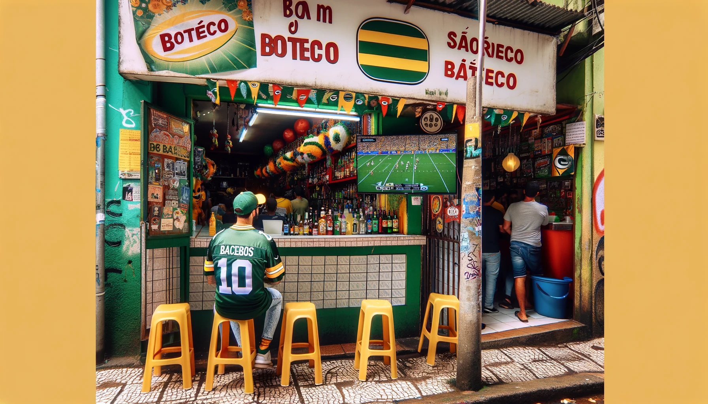

_Last Updated: May 2024_

## Going to a Sports Bar in São Paulo, Brazil
For some reason or another, finding a place like Buffalo Wild Wings is pretty difficult in Brazil. I'm talking about an establishment with 100+ inch televisions, projectors, TV's at every table - that sort of deal. Typically, soccer matches between clubs are played on small TV's at the corner botecas. Fans used to gather at Applebee's but, it appears that most locations in São Paulo have closed. However, there is also the American Staple - [TGI Fridays](https://www.google.com/maps/search/TGI+Fridays/@-23.6011142,-46.6829626,14z/data=!3m1!4b1?entry=ttu), but they're in shopping malls. We cannot speak from experience, but that seems like a bit of a different vibe for watching an NFL game...

Here is a short list of bars in São Paulo that we know of with TV's that will play the NFL. The list includes sports bars in São Paulo that we know will play various American Sports.

- [O'Malley's Irish Pub](https://www.omalleysbar.net/) - _typically __PACKED__ with NFL fans every game day. This is also the official [PackersEverywhere](https://www.packerseverywhere.com/find-a-bar/bar-details/Index?id=dade858a-fa8f-6ce3-be09-ff000095b832) watch location for all Green Bay games_
- [Goose Island Brewery São Paulo](https://www.instagram.com/gooseislandsp/) - _The Chicago staple has an outpost in Sao Paulo with one small TV on the main floor_
- [Flames Tap House](https://www.instagram.com/flamestaphouse/) - _few smaller TV's + they've advertised the NFL on their Instagram before_
- [Louie Louie Irish Pub](https://www.google.com/maps/place/Louie+Louie+bar/@-23.5669222,-46.6689673,13.61z/data=!4m10!1m2!2m1!1ssports+bar,+sao+paulo!3m6!1s0x94ce50bf0d6a9373:0xd5d2f7a001bd7582!8m2!3d-23.6214099!4d-46.6886394!15sChVzcG9ydHMgYmFyLCBzYW8gcGF1bG9aFiIUc3BvcnRzIGJhciBzYW8gcGF1bG-SAQlpcmlzaF9wdWKaASNDaFpEU1VoTk1HOW5TMFZKUTBGblNVUkJPVGMyZGxKbkVBReABAA!16s%2Fg%2F1tdryfkn?entry=ttu) - _we have not gone here yet, let us know how it is_
- [The Blue Pub](https://www.google.com/maps/place/The+Blue+Pub/@-23.5631298,-46.691461,13z/data=!4m10!1m2!2m1!1ssports+bar,+sao+paulo!3m6!1s0x94ce59b7f5dbd095:0x8e95eaf51d622918!8m2!3d-23.5631298!4d-46.6502623!15sChVzcG9ydHMgYmFyLCBzYW8gcGF1bG9aFiIUc3BvcnRzIGJhciBzYW8gcGF1bG-SAQNiYXKaASRDaGREU1VoTk1HOW5TMFZKUTBGblNVUkhhbHBsYVhGblJSQULgAQA!16s%2Fg%2F1w15_ktp?entry=ttu) - _Specifically, this place calls out soccer, but doesn't hurt to reach out to them_
- [Resenha Sports Bar](https://www.google.com/maps/place/Resenha+Sports+Bar/@-23.5531014,-46.5634906,17z/data=!4m6!3m5!1s0x94ce5e85438d85c7:0xb8d5a338010ab0d2!8m2!3d-23.5529904!4d-46.563481!16s%2Fg%2F11fzf7v1zl?entry=ttu) - _This looks the most like a true American Sports bar - however, we have never been_
- [TGI Fridays](https://www.google.com/maps/search/TGI+Fridays/@-23.6011142,-46.6829626,14z/data=!3m1!4b1?entry=ttu) - _Exactly what you think this is_
- [NBA House](https://nbahouse.com.br/) - _The NBA has been on the rise in Brazil - we have not been, but this looks like a great place to watch the NBA with other fans_
- [Champions League Experience](http://www.championsexperience.com.br/) - _The name says it all, but they've got big televisions and arcade games_

Our one piece of advice is to reach out to the bar on Instagram or via What'sApp to confirm that they will have the game you are looking for. It's happened a couple times where we have gone to a "sports bar" only to find that they did not have the game on.

If there are any sports bars missing from the list above, please [reach out to us](/contact/) and we will update the post.
