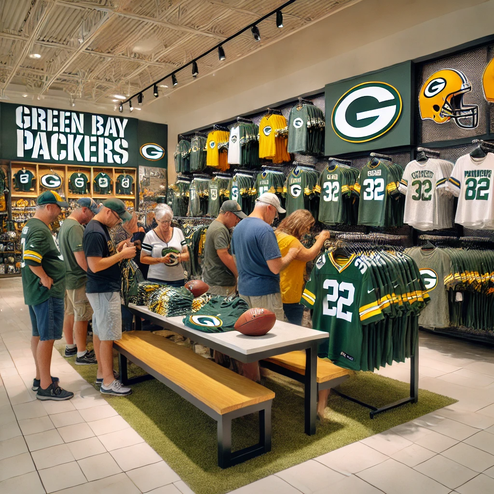
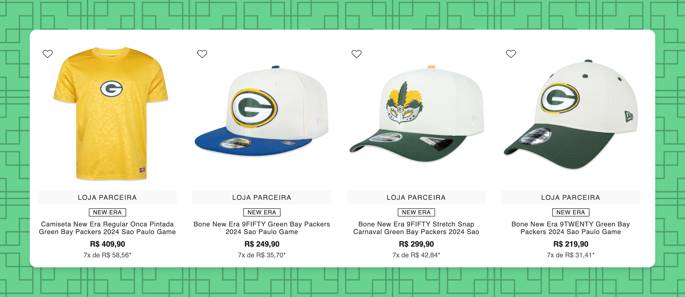
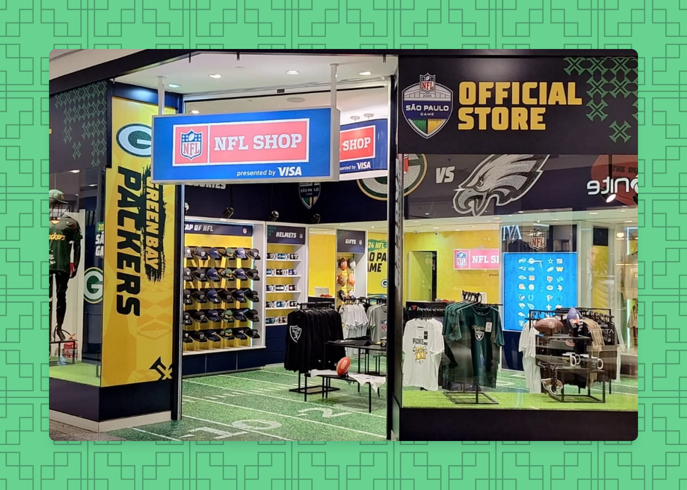
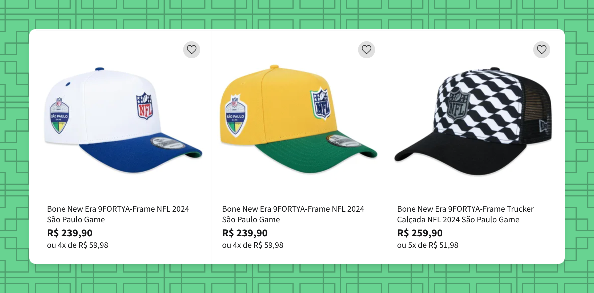
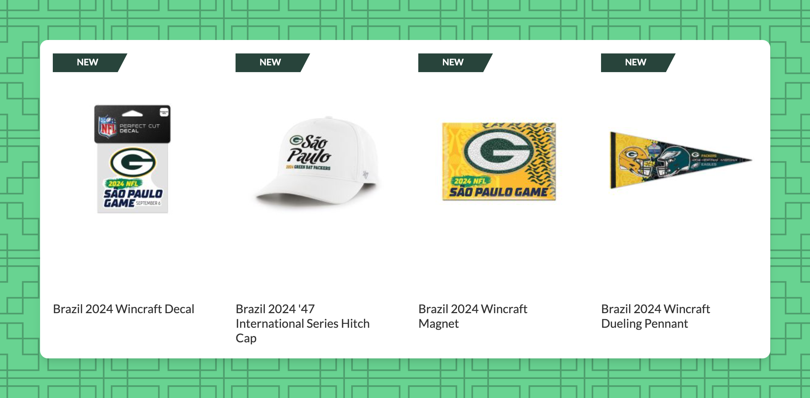
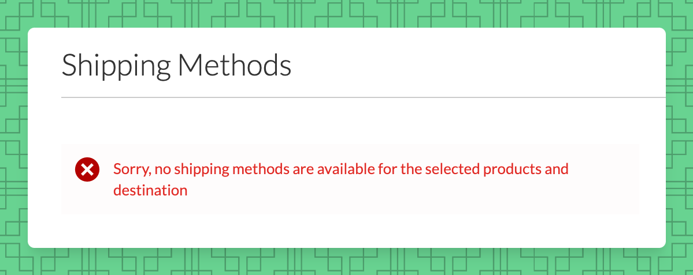

# Where to Buy NFL Merchandise in São Paulo

It should be noted that because of the NFL in São Paulo game between the **Green Bay Packers** and the **Philadelphia Eagles** - that there will be more merchandise for both of those teams. If you are still looking for a team to cheer for, read our reasons why we love the Packers [on the main page of our website](https://cabecadequeijo.com).

From what we've been seeing online - there are some very cool, *exclusive* **NFL in São Paulo** merchandise. This includes leopard print hats, leopard print shirts, NFL shirts, NFL hats with the Rio de Janeiro sidewalk pattern, and other items.

**São Paulo game Exclusive Items:** 
The screenshot above is a little teaser of the items made exclusively for the NFL São Paulo Game. You can see that the colors of Brazil, Samba, and the Jaguar are incorporated in the designs. If you have a keen eye, you'll notice other little nods to Brazilian culture. If you scroll down to the `Brazil Online Outlets` section, you'll see where you can buy these items.

### Official NFL Store Locations:
There are a handful of **NFL Stores** at the various airports and shopping malls around Brazil. Most notably, you will be able to shop at both **GRU** and **CGH Airports** in São Paulo and the **GIG** and **SDU Airports** in Rio de Janeiro. There are also some stores in **Shopping Morumbi** in São Paulo and **Barra Shopping** in Rio de Janeiro.

The prices for the stores above will vary. With the NFL Stores, you are buying NFL licensed, official merchandise - so, it can be very expensive. About **40 USD / 200 BRL** for a t-shirt. If you are looking for a jersey, a sweatshirt or other merchandise, they have it, but it will be expensive.

### Weekend of the São Paulo Game:
Leading up to the game and after the game there will be various [NFL Fan experiences](https://www.nfl.com/international/games/saopaulo/) where you will be able to purchase team merchandise. We are not aware of what the selection will be, but we anticipate that it will be similar to the Official NFL Store selection.

### Brazil Online Outlets:
Since this is Brazil, there are TONS of different options to buy your favorite team's merchandise online.

Some of the places where we have found NFL merchandise are at the following shops - 
- [Renner](https://www.lojasrenner.com.br/p/camiseta-comfort-em-algodao-com-estampa-nfl-packers/-/A-927784120-br.lr?sku=927784162)
  - Renner has the most diverse selection of clothing at the best prices. The link above will show you a t-shirt for less than 100 BRL (~$20 USD). At the time of writing, there are 49 options for Packers fans and 11 options for Eagles fans. Options for other teams are typically hats.
- [Sport America](https://www.sportamerica.com.br/futebol-americano/)
  - This store is the only store that we saw that has football helmets + pads for people looking to play the sport. They also have a Packers flag, keychain, and other accessories. The pricing is slightly less than the NFL Store.
- [Netshoes](https://www.netshoes.com.br/busca2?nsCat=Natural&q=NFL)
  - Netshoes has a selection of Nike merchandise like official team shorts, jaguar-print shirts, and other options for a wide-range of prices. In our opinion this is the best choice for most people.
- [Loja America](https://www.netshoes.com.br/futebol-americano/camisetas/nfl)
  - There are 31 teams with t-shirts available for sale on the Loja Amerca store for only 90 BRL (~$20 USD). There are also jerseys from different teams, hats, and other accessories that fans can purchase.
- [Centuaro](https://www.centauro.com.br/busca/green-bay-packers)
  - At the time of writing Centuaro has over 100 items for Green Bay Packers fans and [30 products for Eagles fans](https://www.centauro.com.br/busca/philadelphia-eagles). 
- [NFL Store Brazil](https://www.lojanfl.com.br/)
  - This will be expensive, but authentic, licensed merchandise.

### United States Online Outlets:
- [Packers Pro Shop](https://packersproshop.com)
- [NFL Store](https://nflstore.com)

We won't go into too much detail about the options above because the shipping costs to Brazil are very expensive.

Hope you found this post useful!
