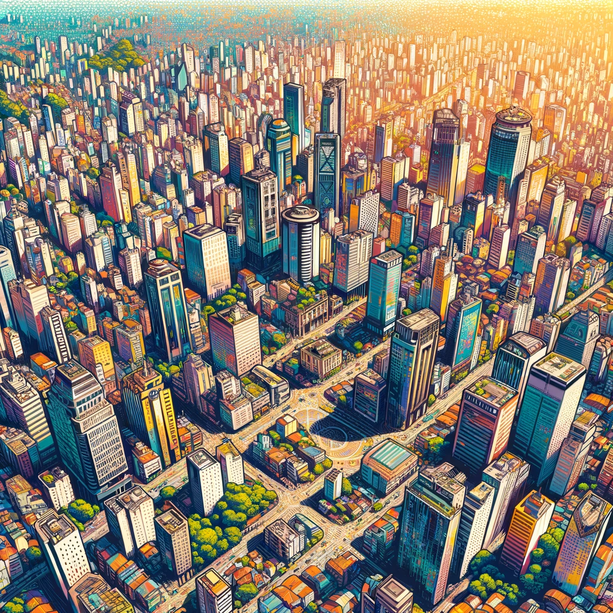
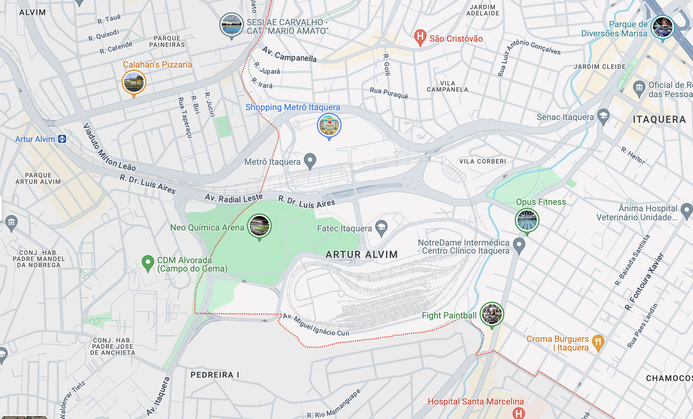
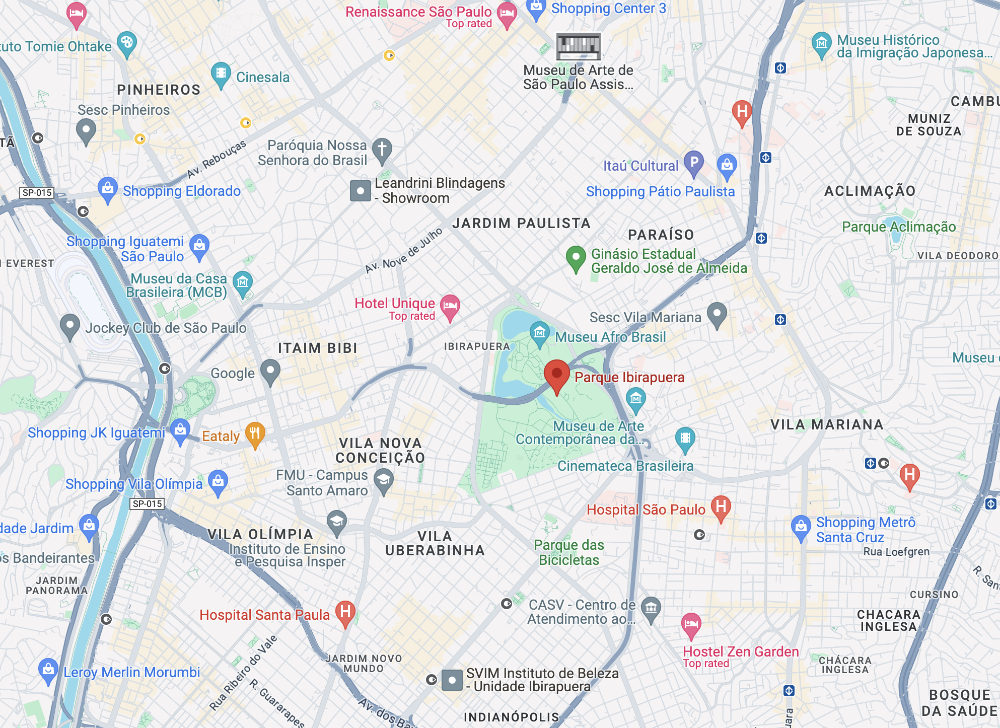

## Quick Intro to Sao Paulo, Brazil
Sao Paulo is a city of over 22.5 million people - nearly 2.5x the population of New York City. Sprawling over the 587.3 mi² - where as NYC is 302.6 mi². 🤯

Naturally with a city this large, being able to find a great neighborhood to stay in can be a bit tricky. There are of course, the American hotel chains that you are already familiar with - like Holiday Inn, Radisson, or Renaissance. You'll also be able to find a [large amount of AirBnB's across the city](https://www.airbnb.com/s/Sao-Paulo--Brazil/homes?tab_id=home_tab&refinement_paths%5B%5D=%2Fhomes&flexible_trip_lengths%5B%5D=one_week&monthly_start_date=2024-06-01&monthly_length=3&monthly_end_date=2024-08-01&price_filter_input_type=0&channel=EXPLORE&query=Sao%20Paulo%2C%20Brazil&place_id=ChIJ0WGkg4FEzpQRrlsz_whLqZs&date_picker_type=calendar&source=structured_search_input_header&search_type=filter_change&price_filter_num_nights=5&ne_lat=-23.510494766766186&ne_lng=-46.595548967164746&sw_lat=-23.63166153051278&sw_lng=-46.69877349702497&zoom=12.79479972455441&zoom_level=12&search_by_map=true&checkin=2024-09-05&checkout=2024-09-08) with different amenities. **Word of caution** - AirBnB's can be hit or miss - so, be sure to read the reviews and ensure you are staying with a '[Superhost](https://www.airbnb.com/help/article/828)'.

This guide is aiming to tell you a little bit more about the different neighborhoods in Sao Paulo to help you determine where to stay for the NFL Game here.

As the NFL announces events that will occur around the city, we will be sure to update this post with neighborhoods that are near those venues.

## [Itaquera Neighborhood](https://www.google.com/maps/place/Itaquera,+S%C3%A3o+Paulo+-+State+of+S%C3%A3o+Paulo,+Brazil/@-23.5339784,-46.4716919,13.93z/data=!4m6!3m5!1s0x94ce66b99a42eac7:0x8ed06d80800b0a3c!8m2!3d-23.5374198!4d-46.4536983!16s%2Fm%2F0fq2p7t?entry=ttu) (closest to the Stadium)
The Neo Química Arena, home to the Corinthians Soccer Club, is situated in the eastern part of São Paulo, in the neighborhood of Itaquera. This is where all the action will be for the Friday night game between the Green Bay Packers and the Philadelphia Eagles. This area is primarily residential with a strong community vibe, featuring a mix of apartment buildings and modest single-family homes. However, it has ongoing developmental changes, spurred by the construction of the Neo Química Arena for the 2014 FIFA World Cup. This area is known for its accessibility due to extensive public transportation options, including the Corinthians-Itaquera Metro station nearby. The neighborhood also hosts the Itaquera Shopping Center, providing locals and visitors with various shopping and dining options.

## [Moema Neighborhood](https://www.google.com/maps/place/Moema,+S%C3%A3o+Paulo+-+State+of+S%C3%A3o+Paulo,+Brazil/@-23.6020717,-46.6768876,17z/data=!3m1!4b1!4m6!3m5!1s0x94ce59f8e9ffac95:0xd02a34bc9438ea3b!8m2!3d-23.6020214!4d-46.6721032!16s%2Fg%2F122tz_58?entry=ttu)
Moema is an upscale neighborhood in São Paulo known for its blend of traditional charm and modern amenities. Characterized by leafy streets and a friendly atmosphere, Moema offers a high quality of life with its array of fine restaurants, chic boutiques, and lively bars. We'd recommend checking out Bar do Juarez for Picanha or Bar Original for stupidly cold beers. The neighborhood is highly pedestrian-friendly, featuring bike paths and well-maintained sidewalks that encourage walking. Moema also boasts proximity to Ibirapuera Park, one of the city’s largest and most popular green spaces, making it a desirable area for families and outdoor enthusiasts alike.

## [Pinheiros Neighborhood](https://www.google.com/maps/place/Pinheiros,+S%C3%A3o+Paulo+-+State+of+S%C3%A3o+Paulo,+Brazil/@-23.5620058,-46.6987426,15z/data=!3m1!4b1!4m6!3m5!1s0x94ce5798cb16268f:0xa94014a3e39a3708!8m2!3d-23.5635787!4d-46.6916068!16s%2Fg%2F155ryzty?entry=ttu)
Pinheiros is a vibrant and eclectic neighborhood in São Paulo, distinctly different from both Moema and the area around Neo Química Arena. Unlike the more residential and upscale Moema, Pinheiros is known for its bustling nightlife, avant-garde galleries, and a thriving culinary scene, offering a mix of traditional Brazilian and international cuisines. The neighborhood is also a hub for creative industries, featuring numerous startups and co-working spaces. In contrast to the area near Neo Química Arena, which is more known for its stadium and associated developments, Pinheiros boasts a richer cultural atmosphere and a more dynamic urban experience, making it popular among younger residents and professionals. It also borders [Beco do Batman](https://www.google.com/maps/place/Beco+do+Batman/@-23.5566009,-46.6891539,17z/data=!3m1!4b1!4m6!3m5!1s0x94ce575858b6a5b9:0xc5b1a9636043ff22!8m2!3d-23.5566009!4d-46.686579!16s%2Fg%2F11b6pwftrw?entry=ttu) - a famous outdoor grafiti gallery with electric shops.

## Neighborhoods Near Ibirapuera Park ([Jardim Paulista](https://www.google.com/maps/place/Jardim+Paulista,+S%C3%A3o+Paulo+-+State+of+S%C3%A3o+Paulo,+Brazil/@-23.5339784,-46.4716919,13.93z/data=!4m6!3m5!1s0x94ce59c2db1faacb:0x186ce70be3f34d44!8m2!3d-23.5739787!4d-46.6606906!16s%2Fg%2F120r00xg?entry=ttu), [Vila Nova](https://www.google.com/maps/place/Vila+Nova+Concei%C3%A7%C3%A3o,+S%C3%A3o+Paulo+-+State+of+S%C3%A3o+Paulo,+Brazil/@-23.5742553,-46.6704143,15z/data=!4m6!3m5!1s0x94ce57575900735f:0xdfe8f65daf38be97!8m2!3d-23.5917828!4d-46.6727333!16s%2Fg%2F121pqdsq?entry=ttu), etc.)
The neighborhoods surrounding Ibirapuera Park in São Paulo are some of the city's most sought-after areas, offering a mix of residential comfort and cultural vibrancy. Ibirapuera Park is a sprawling green oasis that has tons of trails, small restaurants to grab a bite to eat and plenty of Agua de Coco (coconut water) vendors. Moema lies directly to the south of the park, known for its upscale living and pedestrian-friendly streets. To the north, you'll find Vila Nova Conceição, an affluent area with luxurious properties and excellent restaurants. Jardim Paulista, to the west of the park, combines a residential feel with commercial dynamism, hosting a variety of shops, cafes, and cultural attractions. Each of these neighborhoods shares proximity to Ibirapuera Park, enhancing their appeal with easy access to one of the city’s largest green spaces.

## [Faria Lima Neighborhood](https://www.google.com/maps/place/Av.+Brig.+Faria+Lima,+S%C3%A3o+Paulo+-+SP,+Brazil/@-23.5787618,-46.6897521,15.83z/data=!4m6!3m5!1s0x94ce576d1b6136f3:0xd07acf864bcd7990!8m2!3d-23.5775252!4d-46.6868419!16s%2Fm%2F026wnsp?entry=ttu)
We would recommend not staying in the Faria Lima neighborhood for the NFL game - stay nearby in Pinheiros.

The Faria Lima neighborhood is renowned as a financial hub, filled with high-rise office buildings and headquarters of major corporations. It contrasts sharply with the residential and leisurely atmospheres of neighborhoods like Moema. Faria Lima is characterized by modern architecture, upscale restaurants, and vibrant nightlife, catering to a professional crowd. It also features high-end shopping centers and is a key node for the city's business activities, drawing professionals from across São Paulo. Nearby, the bustling Pinheiros neighborhood adds a cultural and bohemian flair, complementing the business-oriented nature of Faria Lima.

## Other Neighborhoods
Obviously, with a city so large, there are hundreds of different neighborhoods across the metropolitan area. As with any travel, please research all options and make sure it fits your needs. A short list of other options are below:

- [Vila Madalena](https://www.google.com/maps/place/Vila+Madalena,+S%C3%A3o+Paulo+-+State+of+S%C3%A3o+Paulo,+Brazil/@-23.5787618,-46.6897521,15.83z/data=!4m2!3m1!1s0x94ce57be69847fa9:0xd423d197dd9d1e01?entry=ttu) - Known for its bohemian vibe, art galleries, and vibrant street art. It's a top choice for those interested in nightlife and local culture.
- [Higienópolis](https://www.google.com/maps/place/Higien%C3%B3polis,+S%C3%A3o+Paulo+-+State+of+S%C3%A3o+Paulo,+Brazil/@-23.548177,-46.6630061,16z/data=!3m1!4b1!4m6!3m5!1s0x94ce583bf6fab555:0xf467850dd14cd5dd!8m2!3d-23.5457512!4d-46.6599426!16s%2Fg%2F120k19hl?entry=ttu) - Offers a more refined experience with historic buildings, upscale shopping, and quiet, tree-lined streets.
- [Bela Vista](https://www.google.com/maps/place/Bela+Vista,+S%C3%A3o+Paulo+-+State+of+S%C3%A3o+Paulo,+Brazil/@-23.5620283,-46.6571093,15z/data=!3m1!4b1!4m6!3m5!1s0x94ce59b756463d61:0x9f3d1e6f7f40964!8m2!3d-23.5554048!4d-46.6456426!16s%2Fg%2F1224122h?entry=ttu) - Located near the city center, this area is rich in Italian heritage and culinary delights, making it ideal for food enthusiasts.
- [Liberdade](https://www.google.com/maps/place/Liberdade,+S%C3%A3o+Paulo+-+State+of+S%C3%A3o+Paulo,+Brazil/@-23.5620283,-46.6571093,15z/data=!4m6!3m5!1s0x94ce59a00cc9896b:0x4d7fa8becba4e40d!8m2!3d-23.5599169!4d-46.6312586!16s%2Fg%2F1233lxsm?entry=ttu) - Known as the Japanese district, it's great for experiencing São Paulo's multicultural aspect, with numerous Asian shops and restaurants.

## How to Get To/From Corinthians Arena From Your Neighborhood
The primary way most Paulistanos go to/from Corinthians stadium would be by using the Metro. The Red Line can take you into the city to connect to other lines to get you closer to your hotels. You can [read more about different transit options to get around Sao Paulo here](/blog/how-to-get-around-sao-paulo).
