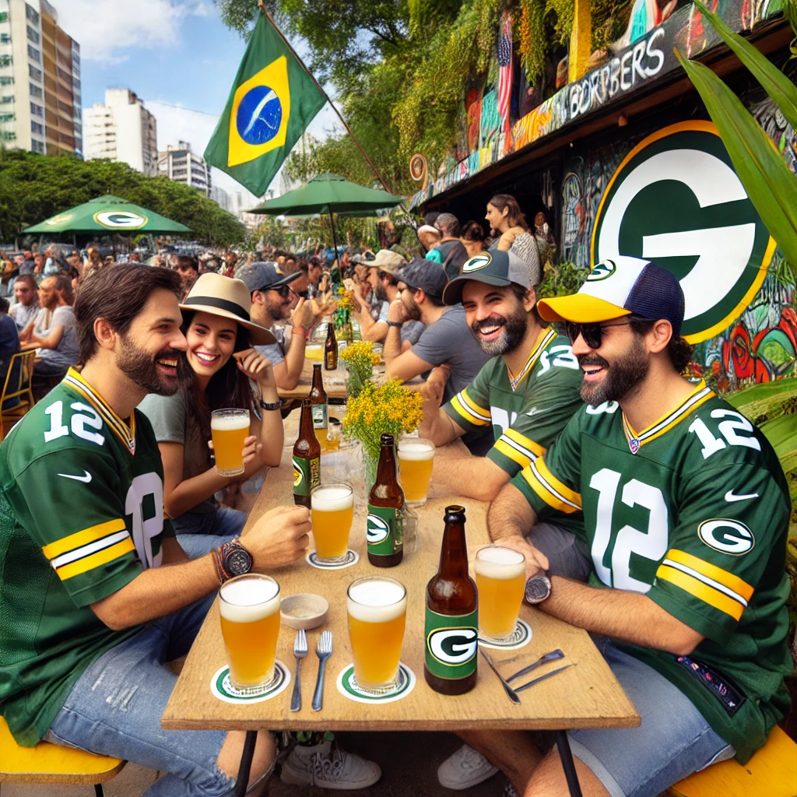
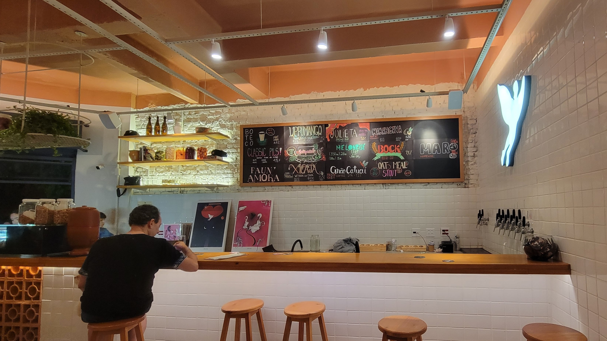

#### [Aqui está um link para o Google Maps com mais de 40 opções de cervejas artesanais em São Paulo](https://maps.app.goo.gl/9fSNUafi48tqup1D6)

**Nota** - Pelo que sabemos, não há muito em termos de cervejaria artesanal ou bar perto da Arena Corinthians. Sua melhor opção será pegar uma Brahma ou Original dos vendedores de rua fora do estádio ou esperar até estar dentro para beber.

# As Melhores Cervejas Para Experimentar no Brasil Durante o Jogo da NFL em São Paulo

[Se precisar de ajuda para pedir uma cerveja, confira nosso guia de 2 minutos aqui](/blog/how-to-order-a-beer-in-portuguese/).

Claro, existem as favoritas - um `estupida gelada chopp` - ou seja, uma cerveja estupidamente gelada. Esses chopps são tradicionalmente cervejas mais leves, de estilo pilsner ou lager, que você pode encontrar em praticamente qualquer lugar da cidade. Existem algumas grandes cervejarias brasileiras - Brahma, Antarctica Original (minha favorita), Skol, Itaipava e outras - que criam esse estilo. E você pode geralmente consegui-la por algumas poucas reais em um copo de ~300 ml (qualquer preço maior é roubo).

Pense neste chopp como sua "opção padrão". O velho amigo que nunca te decepciona. Ótimo para dias de praia, num churrasco, uma cerveja no almoço e muito mais.

De acordo com [um post antigo no HomeBrewTalk](https://www.homebrewtalk.com/threads/brazilian-chopp-beer.121966/), um usuário, `erik2113`, afirmou que um chopp é -
> O método de servir o chopp é bem específico para criar a espuma que mantém uma barreira entre o oxigênio e a cerveja, evitando que ela estrague enquanto você a bebe.

No entanto, nos últimos anos, houve um grande aumento na criação e expansão das cervejarias artesanais brasileiras, ou Cervejarias.

O próximo passo acima de uma cerveja chopp seria a Eisenbahn, Cervejaria Colorado ou Black Princess. Essas cervejarias produzem diferentes estilos, mas nada muito notável. Essas cervejas geralmente custam alguns dólares americanos no Oxxo ou no supermercado. São boas, mas não ótimas.

Vamos direto para o nível de cerveja artesanal - ou Cervejas Artesanais - que pode custar entre $5 USD a $8 USD, dependendo de onde você for. Os estilos podem ser um pouco decepcionantes ou intensos. Pense em algo polarizador como uma Rauchbier - algumas cervejarias usam maltes defumados de forma sutil, enquanto outras vão ao extremo e parece que você acabou de fumar um maço de cigarros. Isso acontece em vários outros estilos.

Para economizar seu tempo, aqui está uma lista rápida e não ordenada de algumas das minhas cervejarias artesanais favoritas que visitei ou tomei em casa:
- [Trilha Cervejaria](https://maps.app.goo.gl/nSVREYYKco8cPLsP6) (ou a sua [Fermentaria](https://maps.app.goo.gl/fo7dPTg256xHUFP4A))
- [Rivas Brewing Company](https://maps.app.goo.gl/tfwjx14hFmnx7R4Z6)
- [Croma Brewing Company (IPAs)](https://maps.app.goo.gl/WcSPm4ma3owF1ia28)
- [East Zone Tap Room](https://maps.app.goo.gl/VYEA2hQW4zC5bwbV7)

Se você está procurando um lugar para experimentar **VÁRIAS** cervejas diferentes, aqui está o que eu recomendo:
- [Emporium Alto Pinheiros](https://maps.app.goo.gl/u6bBygpc6dHh1oT2A) (centenas de cervejas de todo o Brasil, América do Sul e do mundo)
- [La Fraternité](https://maps.app.goo.gl/mucdeX6xX3WiTqtF7)
- [VKS Beer House](https://maps.app.goo.gl/fqca2SJZryNpC2cW6)

### [Google Maps com mais de 40 opções de cervejas artesanais em São Paulo](https://maps.app.goo.gl/9fSNUafi48tqup1D6)

Beba com responsabilidade.

Se você está procurando o [Bar PackersEverywhere.com](https://www.packerseverywhere.com/find-a-bar/bar-details/Index?id=dade858a-fa8f-6ce3-be09-ff000095b832) em São Paulo, [você pode ler mais sobre nosso anúncio aqui](/blog/announcing-omalleys-as-the-packers-everywhere-bar/).
