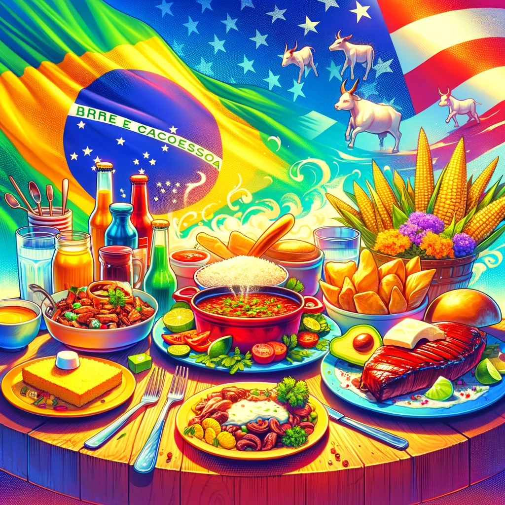

Explorar os cenários culinários de Wisconsin e Brasil pode parecer um estudo de contrastes, mas você pode se surpreender ao descobrir várias semelhanças deliciosas. Ambas as regiões possuem uma rica herança de utilização de ingredientes locais para criar pratos reconfortantes que se tornaram pilares de suas respectivas culturas culinárias. Aqui está um olhar sobre alguns dos alimentos onde Wisconsin e Brasil encontram pontos em comum.

## Queijo: Uma História de Amor

### Wisconsin
Conhecido como a "Terra dos Laticínios da América," Wisconsin é famoso por seu queijo, produzindo mais de 600 variedades. Coalho, cheddar e colby são alguns dos favoritos do estado.

### Brasil
O Brasil pode não ser internacionalmente reconhecido como uma potência do queijo, mas tem uma cena de queijo artesanal em crescimento, com o queijo Minas liderando. Este queijo macio e suave é um item básico nas casas brasileiras.

## Delícias Carnívoras: Do Churrasco ao BBQ

### Wisconsin
Wisconsin adora suas carnes, com bratwursts (salsichas de estilo alemão) sendo um dos favoritos locais. Elas são frequentemente apreciadas grelhadas em festas de tailgate e são essenciais durante qualquer evento esportivo.

### Brasil
Churrasco, ou churrasco brasileiro, é o sonho de qualquer amante de carne, com foco em vários cortes de carnes grelhadas, incluindo boi, porco e frango. Assim como um churrasco em Wisconsin, o churrasco no Brasil é um evento social que reúne famílias e amigos.

## Ensopados e Casseroles: Conforto em uma Panela

### Wisconsin
O casserole de Wisconsin, ou "hotdish," muitas vezes apresenta uma base cremosa, com ingredientes como batatas, carne moída e queijo, coberto com cebolas crocantes ou farinha de rosca.

### Brasil
Feijoada é o amado ensopado brasileiro, rico com feijão preto e uma variedade de cortes de porco ou boi. Servido sobre arroz, é uma refeição farta que é apreciada em todo o país, especialmente nos finais de semana.

## Milho: Um Ingrediente Básico

### Wisconsin
O milho é parte integrante da agricultura de Wisconsin, e aparece em inúmeros pratos, desde polenta até pão de milho, apreciado especialmente durante a colheita do outono.

### Brasil
De forma semelhante, o milho é amplamente utilizado na culinária brasileira, aparecendo em pratos tradicionais como pamonha e curau, especialmente populares durante as celebrações da Festa Junina.

## Doces: Um Final Açucarado

### Wisconsin
A torta de cranberry, feita com cranberries colhidas localmente, é uma iguaria doce em Wisconsin, frequentemente apreciada durante a temporada de festas.

### Brasil
Brigadeiros são a resposta do Brasil aos trufas, feitos com leite condensado, cacau em pó e manteiga, enrolados em granulados de chocolate. Favoritos em festas, esses docinhos são indispensáveis nas comemorações.

## Conclusão

Embora Wisconsin e Brasil possam estar a milhas de distância, seus mundos culinários se sobrepõem no amor por alimentos ricos e reconfortantes que unem as pessoas. Seja pelas texturas cremosas de seus queijos amados ou pelos festins de carne comunitários, há um espírito compartilhado na maneira como abordam a comida - um testemunho da linguagem universal dos prazeres gastronômicos.
