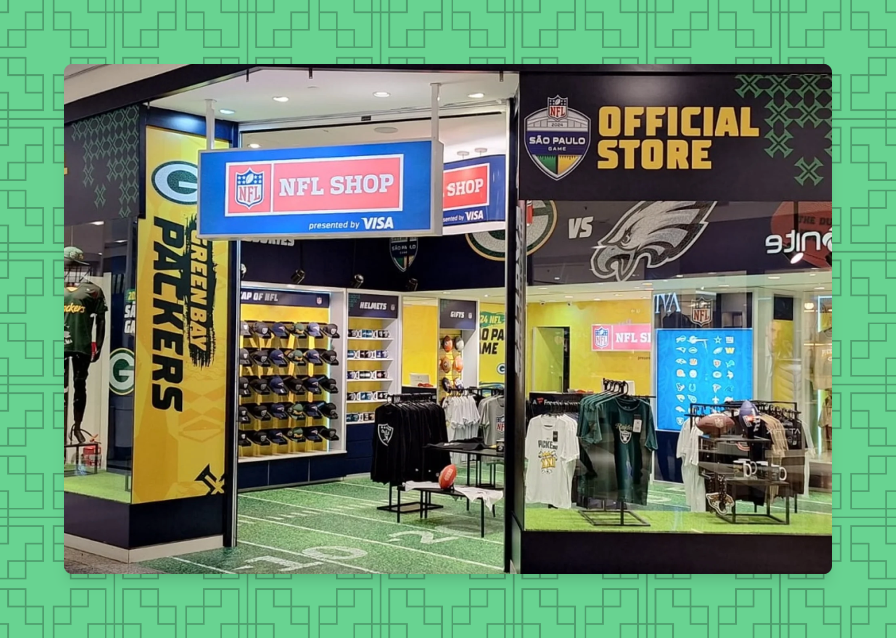
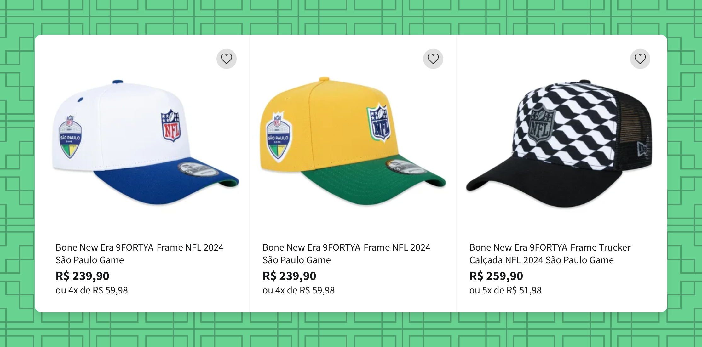

# Onde Comprar Produtos da NFL em São Paulo

Vale destacar que, devido ao jogo da NFL em São Paulo entre o **Green Bay Packers** e o **Philadelphia Eagles**, haverá mais produtos disponíveis para esses dois times. Se você ainda está procurando um time para torcer, leia nossos motivos pelos quais amamos os Packers [na página principal do nosso site](https://cabecadequeijo.com).

Pelo que vimos online, existem alguns itens muito legais e *exclusivos* de **NFL em São Paulo**. Isso inclui bonés com estampa de oncinha, camisetas, bonés da NFL com o padrão da calçada de Copacabana, e outros itens.

**Itens Exclusivos do Jogo em São Paulo:** 
A captura de tela acima é um pequeno teaser dos itens feitos exclusivamente para o jogo da NFL em São Paulo. Você pode ver que as cores do Brasil, o Samba e a Onça estão incorporados nos designs. Se você tiver um olhar atento, notará outras pequenas referências à cultura brasileira. Se você descer até a seção `Lojas Online no Brasil`, verá onde pode comprar esses itens.

### Localizações Oficiais da Loja NFL:
Existem algumas **Lojas da NFL** nos diversos aeroportos e shoppings ao redor do Brasil. Notadamente, você poderá fazer compras tanto nos **Aeroportos GRU** e **CGH** em São Paulo quanto nos **Aeroportos GIG** e **SDU** no Rio de Janeiro. Também há lojas no **Shopping Morumbi** em São Paulo e no **Barra Shopping** no Rio de Janeiro.

Os preços nas lojas mencionadas podem variar. Nas Lojas NFL, você estará comprando produtos licenciados e oficiais da NFL, portanto, eles podem ser bem caros. Cerca de **40 USD / 200 BRL** por uma camiseta. Se você estiver procurando por uma jersey, um moletom ou outros produtos, eles têm, mas será caro.

### Fim de Semana do Jogo em São Paulo:
Nos dias que antecedem e após o jogo, haverá várias [experiências para fãs da NFL](https://www.nfl.com/international/games/saopaulo/) onde você poderá comprar produtos dos times. Não sabemos qual será a seleção disponível, mas esperamos que seja semelhante à seleção da Loja Oficial da NFL.

### Lojas Online no Brasil:
Como estamos no Brasil, há MUITAS opções diferentes para comprar produtos do seu time favorito online.

Alguns dos lugares onde encontramos produtos da NFL são as seguintes lojas:
- [Renner](https://www.lojasrenner.com.br/p/camiseta-comfort-em-algodao-com-estampa-nfl-packers/-/A-927784120-br.lr?sku=927784162)
  - A Renner tem a seleção mais diversa de roupas com os melhores preços. O link acima mostrará uma camiseta por menos de 100 BRL (~20 USD). No momento da redação, há 49 opções para fãs dos Packers e 11 opções para fãs dos Eagles. As opções para outros times geralmente são bonés.
- [Sport America](https://www.sportamerica.com.br/futebol-americano/)
  - Esta loja é a única que vimos que tem capacetes e protetores para pessoas que querem praticar o esporte. Eles também têm uma bandeira dos Packers, chaveiros e outros acessórios. Os preços são um pouco menores que os da Loja NFL.
- [Netshoes](https://www.netshoes.com.br/busca2?nsCat=Natural&q=NFL)
  - A Netshoes tem uma seleção de produtos da Nike, como shorts oficiais dos times, camisetas com estampa de oncinha e outras opções com uma ampla faixa de preços. Em nossa opinião, esta é a melhor escolha para a maioria das pessoas.
- [Loja America](https://www.netshoes.com.br/futebol-americano/camisetas/nfl)
  - Há camisetas de 31 times disponíveis para venda na Loja America por apenas 90 BRL (~20 USD). Também há jerseys de diferentes times, bonés e outros acessórios que os fãs podem comprar.
- [Centauro](https://www.centauro.com.br/busca/green-bay-packers)
  - No momento da redação, a Centauro tem mais de 100 itens para fãs do Green Bay Packers e [30 produtos para fãs dos Eagles](https://www.centauro.com.br/busca/philadelphia-eagles).
- [Loja NFL Brasil](https://www.lojanfl.com.br/)
  - Será caro, mas os produtos são autênticos e licenciados.

### Lojas Online nos Estados Unidos:
- [Packers Pro Shop](https://packersproshop.com)
- [NFL Store](https://nflstore.com)

Não entraremos em muitos detalhes sobre as opções acima porque os custos de envio para o Brasil são muito caros.

Esperamos que este post tenha sido útil!
