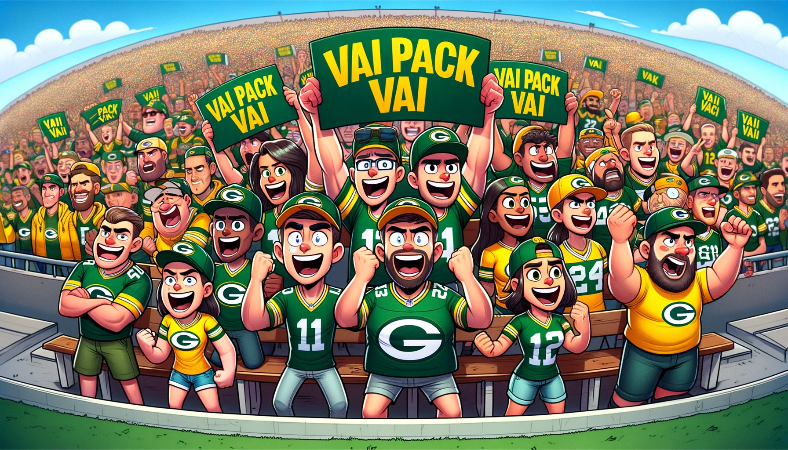
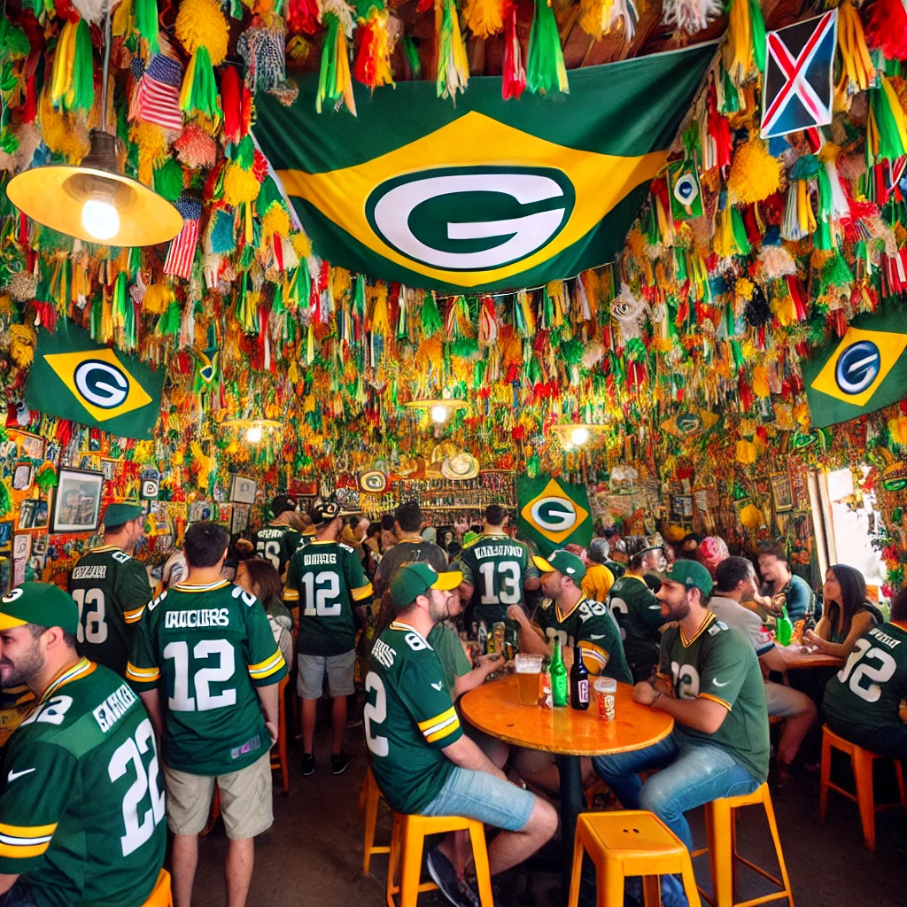

# Por Que Você Deveria Torcer Pelo Green Bay Packers?
Embora o Jogo de São Paulo 2024 entre o Green Bay Packers e o Philadelphia Eagles já tenha passado, você pode estar procurando um time para torcer. Este guia rápido vai te dar alguns motivos rápidos pelos quais você deve escolher o Green Bay Packers. O Green Bay Packers tem uma rica história, repleta de inúmeros campeonatos e jogadores lendários. Torcer pelos Packers significa se juntar a uma comunidade global de fãs apaixonados. Além disso, quem não ama queijo? Aqui estão dez razões rápidas para você torcer pelo Green Bay Packers.

### 1. História Rica
> O Green Bay Packers foi fundado em 1919 e ganhou 13 campeonatos, mais do que qualquer outro time da NFL.

### 2. Comunidade Global
> Torcer pelos Packers significa se juntar a uma comunidade global de fãs apaixonados.

### 3. Cheeseheads
> Os fãs dos Packers são carinhosamente conhecidos como 'Cheeseheads', uma parte divertida e única da cultura dos fãs da NFL.

### 4. Lambeau Field
> A casa dos Packers, o Lambeau Field, é um dos estádios mais icônicos de todos os esportes.

### 5. Propriedade Comunitária
> Os Packers são a única franquia sem fins lucrativos e de propriedade comunitária na NFL. Você pode saber mais sobre a [estrutura de propriedade dos Packers aqui, pelo Green Bay Post Gazette](https://www.packersnews.com/story/sports/nfl/packers/dougherty/2024/09/05/packers-ownership-structure-is-better-than-that-of-brazilian-soccer/75076315007/#:~:text=As%20strange%20as%20it%20might,associations%20in%20Brazilian%20soccer%20are.).

### 6. Time Competitivo
> Os Packers são consistentemente competitivos e têm um time forte, tornando seus jogos emocionantes de assistir.

### 7. Espírito de Underdog
> Como muitos times de futebol brasileiro que surgiram de origens humildes para dominar o cenário global, os Packers começaram como um time de cidade pequena e se tornaram uma potência da NFL. Sua jornada reflete a mentalidade de underdog que ressoa com os fãs de futebol brasileiro, que viram times como Flamengo ou Santos alcançarem destaque.

### 8. Desenvolvimento de Jogadores e Legado
> Os Packers, assim como os clubes de futebol brasileiros, focam fortemente no desenvolvimento de talentos internamente, produzindo jogadores lendários como Bart Starr, Brett Favre e Aaron Rodgers. Da mesma forma, o Brasil é conhecido por nutrir superestrelas do futebol como Pelé, Zico e Neymar, admirados mundialmente.

### 9. Lealdade e Paixão dos Fãs
> Os fãs dos Packers estão entre os mais leais da NFL, frequentemente enfrentando condições congelantes no Lambeau Field. Essa lealdade se assemelha à paixão que os fãs de futebol brasileiro demonstram, desde rivalidades de clubes até a seleção nacional, onde o apoio dos torcedores é um compromisso vitalício.

### 10. Compromisso com a Tradição
> Assim como o futebol brasileiro tem laços profundos com sua rica cultura e tradições futebolísticas, os Packers são um time imerso em história, preservando valores tradicionais do jogo. Ambas as culturas abraçam suas tradições enquanto continuam a evoluir para se manterem relevantes no cenário global.

### 11. Trabalho em Equipe e Comunidade
> A estrutura de propriedade comunitária e sem fins lucrativos dos Packers enfatiza o trabalho em equipe e a colaboração, valores centrais no futebol brasileiro e na sociedade brasileira como um todo. O futebol brasileiro é conhecido por seu estilo coletivo e fluido de jogo, que se alinha com a ênfase dos Packers no trabalho em equipe e envolvimento da comunidade.

### 12. Cores e Símbolos
> As cores verde e dourado dos Packers evocam sentimentos de orgulho nacional para os brasileiros, cuja bandeira também apresenta verde e dourado. Torcer pelos Packers pode parecer familiar e conectado à identidade nacional do Brasil, aumentando o apelo para os fãs brasileiros que já associam essas cores ao orgulho e à vitória.

[Nosso blog](/pt-BR/blog) tem muito mais sobre o [Green Bay Packers](https://packers.com) e como você pode saber mais sobre o time.
